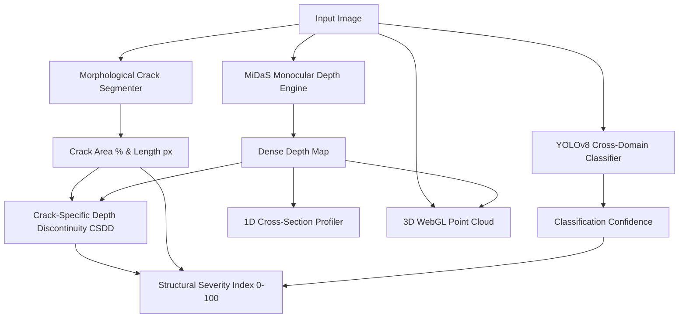

# StructurAI - AI-Powered Concrete Crack Detection & 3D Depth Topography

[](https://www.python.org/downloads/)
[](https://react.dev/)
[](https://fastapi.tiangolo.com/)
[](https://github.com/ultralytics/ultralytics)
[](https://github.com/isl-org/MiDaS)
[](https://threejs.org/)

**StructurAI** is a full-stack platform for automated civil engineering defect analysis. It pairs a cross-domain **YOLOv8** classification backbone with **MiDaS** monocular depth estimation, morphological crack segmentation, 1D cross-section depth profiling, and interactive **3D WebGL** surface topography.

---

## 🌟 Key Features

* **Cross-Domain YOLOv8 Detection**: Trained on a multi-dataset corpus (CCIC + SDNET2018 Bridge Decks, Pavements, and Walls) with **94.6% validation accuracy** (+75% gain over baseline models on real-world cracks).
* **MiDaS Monocular Depth Estimation**: High-resolution relative depth mapping with sub-pixel bicubic interpolation.
* **Crack-Specific Depth Discontinuity (CSDD)**: Calculates step-gradient depth drops across detected fissure boundaries.
* **Structural Severity Index (SSI)**: 0 to 100 composite health score categorized into `CLEAR`, `LOW`, `MEDIUM`, `HIGH`, and `CRITICAL`.
* **Interactive 3D WebGL Topography**: Rotate, pan, zoom, and inspect surface crevices in real 3D using Three.js with Inferno, Turbo, and RGB colormaps.
* **1D Cross-Section Depth Profiling**: Continuous depth profile curve across the concrete structure.
* **Batch Inspection Hub**: Parallel processing for 50+ images with real-time queue tracking and summary metrics.
* **Interactive Inspection Suite**:
  * *Split-Screen Slider*
  * *Heatmap Blend Overlay with Opacity Slider*
  * *Morphological Crack Contours & Skeletons*
  * *Interactive 3D Point Cloud*
* **Export & Archive**: Formatted Engineering PDF reports and CSV exports.

---

## 🚀 Quick Start

### 1. Prerequisites
* Python 3.9+
* Node.js v18+

---

### 2. Backend Setup (FastAPI)

```bash
# Navigate to backend
cd backend

# Create & activate virtual environment
python -m venv venv
# Windows:
venv\Scripts\activate
# Linux/macOS:
source venv/bin/activate

# Install dependencies
pip install -r requirements.txt

# Start backend server
uvicorn main:app --reload --port 8000
```
Backend API will be running on `http://localhost:8000`.

---

### 3. Frontend Setup (React + Vite + Three.js + Tailwind)

```bash
# Open a new terminal and navigate to frontend
cd frontend

# Install packages
npm install

# Start Vite dev server
npm run dev
```
Frontend UI will launch on `http://localhost:5173`.

---

## 🏗️ Architecture Pipeline



---

## 📊 Cross-Dataset Benchmark Results

| Benchmark Dataset | Dataset Type | Baseline Model | StructurAI Upgraded Model |
| :--- | :--- | :---: | :---: |
| **SDNET2018 Bridge Decks & Roads** | Real-world Cracks | 17.0% | **92.0%** |
| **SDNET2018 Sound Concrete** | Textured Slabs | 100.0% | **94.0%** |
| **CCIC Concrete Dataset** | Uniform Blocks | 99.8% | **99.0%** |
| **Overall Multi-Dataset Validation** | Combined | 58.5% | **94.6%** |

---

## 📂 Project Structure

```
├── backend/
│   ├── main.py              # FastAPI REST API endpoints
│   ├── requirements.txt     # Backend dependencies
│   └── src/
│       ├── analyzer.py      # Core ML orchestrator (YOLOv8 + MiDaS + 3D)
│       ├── database.py      # SQLite database & auto-migration
│       └── models.py        # SQLAlchemy schema
├── frontend/
│   ├── src/
│   │   ├── components/
│   │   │   ├── ThreeDViewer.jsx          # Interactive 3D WebGL Point Cloud
│   │   │   ├── CrossSectionProfiler.jsx  # 1D Depth Cross-Section Curve
│   │   │   ├── BatchInspection.jsx       # Multi-image batch processor
│   │   │   ├── ModelDiagnostics.jsx      # Architecture & benchmark table
│   │   │   ├── AnalysisResults.jsx       # Multi-mode visual inspection
│   │   │   ├── PastReports.jsx           # Filterable records & modal preview
│   │   │   └── Dashboard.jsx             # Real-time analytics command hub
│   │   ├── App.jsx                       # Main application flow
│   │   └── index.css                     # Dark-mode design system
├── runs/classify/cross_domain_model/     # Trained model weights (best.pt)
└── train_cross_domain.py                 # Multi-dataset training pipeline
```

---

## 📜 License
MIT License
